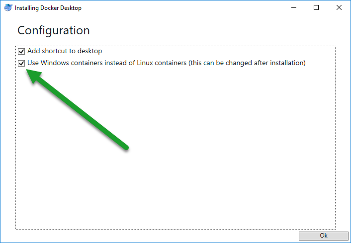
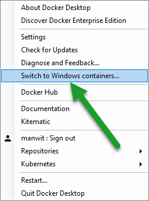
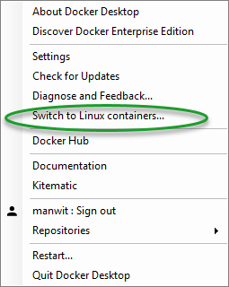

# Use a Powershell Workflow to monitor IIS and your log files in parallel in a Docker container 

In this lab you will be guided through the process of writing a Dockerfile specifically designed for running Windows containers in Docker for hosting ASP.NET web applications. 

I will also guide you to the process of writing a custom monitor using Powershell script and parallel execution, that replaces the ServiceMonitor as provided by Microsoft.

## Audience

The audience for this lab are system and software engineers with basic knowledge of Docker, as well as the more experienced Docker container enthusiast. 

## Executive Summary

The base image for hosting ASP.NET web applications inside a Docker container that Microsoft provides for us, relies on a process called **ServiceMonitor.exe**. It monitors the IIS process to make sure your ASP.NET web application is still running. When your website stops for whatever reason, the ServiceMonitor stops too and you can implement some logic to either restart your IIS process, or exit and allow for tear down of your container by your container orchestrator (such as Kubernetes, AWS ECS, etc.)

This works well in simple scenarios, but when you are hosting an ASP.NET web application for a production web site, there may be other things you want to do **in parallel** besides monitoring IIS, such as **pull logs** from several places and stream them to the STDOUT/console so your container orchestrator can consume them.

This is where things get tricky, because the recommended approach by Microsoft using the ServiceMonitor doesn't really allow for anything other than waiting for IIS to fail, **blocking the process** in the meantime. However, using the Powershell ``Parallel`` keyword we can do both.

In the supplied ``Dockerfile`` and Powershell scripts we provide a fully functional example to build that builds a Docker image that runs an ASP.NET website, that is monitored, with automatic restart, while logs are being streamed to the console.

You just have to replace the sample /wwwroot with your ASP.NET web application folder, and you should be good to go. 

## Prerequisites 

For this lab you need to have:

- Docker Desktop installed: [https://www.docker.com/products/docker-desktop](https://www.docker.com/products/docker-desktop "https://www.docker.com/products/docker-desktop")

## Step 1. Configuring Docker Desktop

### Run Windows Containers in Docker Locally

In order for you to run Windows Containers locally, you need to switch Docker from **Linux** mode to **Windows mode**, by either:

- Selecting to use Windows containers during installation of Docker Desktop, or
- Changing to use Windows containers after installation

#### Selecting to use Windows containers during installation of Docker Desktop

During installation you can configure Docker to have it use Windows containers instead of Linux containers, by clicking the checkbox next to "Use Windows containers instead of Linux containers".

#### Changing to use Windows containers after installation

After Docker Desktop is installed, you can switch between Windows and Linux containers by right-clicking (on Windows) on the Docker icon and click **Switch to Windows containers..**. 

**Note:** If the menu item **Switch to Windows containers..** does not exist, but you see a menu item called **Switch to Linux containers**  it means Docker is already in **Windows mode**.

Read more about switching between Windows and Linux containers here: [https://docs.docker.com/docker-for-windows/#reset](https://docs.docker.com/docker-for-windows/#reset "https://docs.docker.com/docker-for-windows/#reset")  

  
## Step 2. Write a Dockerfile

A **Dockerfile** is basically a text file that contains all the commands that can be executed on the command line to build an image. It tells Docker what commands to execute when creating an image from scratch OR on top of a pre-built image.

In this lab we will be demonstrating how to deploy an ASP.NET web site on top of a bare and publicly available Docker image that already has been prepared by Microsoft, referenced by ``microsoft/aspnet:4.6.2-windowsservercore-ltsc2016``:

[https://github.com/Microsoft/aspnet-docker/tree/master/4.6.2-windowsservercore-ltsc2016](https://github.com/Microsoft/aspnet-docker/tree/master/4.6.2-windowsservercore-ltsc2016 "https://github.com/Microsoft/aspnet-docker/tree/master/4.6.2-windowsservercore-ltsc2016")

Now, open a text editor and create a file called ``Dockerfile``.

### Define base image with FROM

The first command in the Dockerfile will tell Docker to "pull" the Docker image from Microsoft's GitHub repository:

	FROM microsoft/aspnet:4.6.2-windowsservercore-ltsc2016

### Select a shell command-line interface using SHELL

Then, we'll tell Docker which type of shell we will be using to run our commands. By default Windows containers work with the standard Windows CMD shell. We suggest using the PowerShell Shell, by adding the following command to the Dockerfile:

	SHELL ["powershell", "-Command", "$ErrorActionPreference = 'Stop'; $ProgressPreference = 'SilentlyContinue';"]

### Add dependencies with RUN

Now, we can run PowerShell commands using the RUN command. We will be turning on the required Windows features to host our ASP.NET web application, with the following commands:

	RUN Add-WindowsFeature Web-Server
	RUN Add-WindowsFeature Web-Asp-Net45
  
We will also delete the default web application root folder:

	RUN Remove-Item -Recurse C:\inetpub\wwwroot\*
 
### Copy your deployment package or website with COPY

Next, we'll be using the COPY statement to copy the web application folder from your local machine, into the Docker image, as such:

	COPY wwwroot c:\inetpub\wwwroot

OR, if you have create a deployment package for your ASP.NET web application in the form of an MSI, you can also do this: 

	COPY youraspnetapplication.msi /

And then deploy it with:

	msiexec /i youraspnetapplication.msi

This will place the MSI in the root folder C:\ in the image and deploy the package, assuming your MSI deploys in c:\inetpoub\wwwroot automatically.  

### Expose your application to the outside world with EXPOSE

Then, we need to tell Docker which TCP port the ASP.NET web application will be hosted on and needs to be exposed to the outside world.

If your containers will run behind a load-balancer this port number is only used for internal traffic. This is recommended for a production web site. By terminating SSL at the load-balancer you avoid having to install certificates on your containers. 

If you decide to expose the Docker instance directly to the Internet for development or testing, we suggest to use port 80. That is the port we will use for this lab.

### Turn your image into an executable with ENTRYPOINT

On the surface, the CMD and ``ENTRYPOINT`` instructions look like they perform the same function. However, they do perform different functions. ``ENTRYPOINT`` makes your container run as an executable:

	ENTRYPOINT ["C:\\ServiceMonitor.exe", "w3svc"]

The ``ENTRYPOINT`` command tells Docker to fire up the ServiceMonitor application as well as IIS (which internally runs as a process with the name ``w3svc``.  

Read more about how CMD and ENTRYPOINT differ from each other here: [https://docs.docker.com/engine/reference/builder/#understand-how-cmd-and-entrypoint-interact](https://docs.docker.com/engine/reference/builder/#understand-how-cmd-and-entrypoint-interact "https://docs.docker.com/engine/reference/builder/#understand-how-cmd-and-entrypoint-interact")

As discussed before, we will move away from the ServiceMonitor in favor of our own Powershell script with parallel execution of several routines. So, Powershell becomes the ENTRYPOINT for our Docker container:

	ENTRYPOINT ["powershell"] 

### Copy our customer Powershell script into the Docker container

By adding the following command we'll be copying our Powershell script into the container:

	COPY Wait-Service-WithLogging.ps1 /Wait-Service-WithLogging.ps1

### Start IIS

Using the following command, we'll tell docker to start the IIS service when the container starts.

	CMD Start-Service W3SVC

### Best practice: add a HEALTHCHECK to your container

For a well performing container cluster it is important to implement a HEALTHCHECK probe. This is an endpoint on the container that will return with a code that tells Docker whether it is still working properly or not. The HEALTHCHECK will help Docker (or which ever container orchestration platform you are using) decide whether a container can still handle connections and/or should be torn down or restarted.

There are many different ways to implement a HEALTHCHECK but in this case will use the "Invoke WebRequest" PowerShell command to see if our ASP.NET web server is still functional: 

	HEALTHCHECK --interval=5s \  
	 CMD powershell -command \
	    try { \
	     $response = iwr http://localhost/diagnostics -UseBasicParsing; \
	     if ($response.StatusCode -eq 200) { return 0} \
	     else {return 1}; \
	    } catch { return 1 }
 

## Step 3. Understand the custom Powershell script to monitor IIS and pull logs

In the previous steps we copied a custom Powershell script into our Docker image. In this paragraph we will explain its inner workings, as it forms the core of our monitoring and logging logic.

It is inspired by and adapted from the Wait-Service.ps1 script provided by Microsoft at: [https://github.com/MicrosoftDocs/Virtualization-Documentation/blob/live/windows-server-container-tools/Wait-Service/Wait-Service.ps1](https://github.com/MicrosoftDocs/Virtualization-Documentation/blob/live/windows-server-container-tools/Wait-Service/Wait-Service.ps1 "https://github.com/MicrosoftDocs/Virtualization-Documentation/blob/live/windows-server-container-tools/Wait-Service/Wait-Service.ps1")

Although that Powershell script provides a nice alternative to the ServiceMonitor, it does not allow to combine this with logic that monitors log files. The ``Wait-Service-WithLogging.ps1`` script in this lab will do both.

A the heart of this Powershell script lies this code block:

  	#Run commands in parallel.
    Parallel
    {
        # Monitor any additions to logfile #1 and send them to the console. 
        # The -Tail parameter indicates we will be reading a new line that is added at the end of the file
        # The -Wait parameter indicates we will wait indefinitely for new lines being added
        Get-Content -path 'c:\iislog\W3SVC\u_extend1.log' -Tail 1 -Wait
        # Monitor any additions to logfile #3 and send them to the console
        Get-Content -path '\Windows\iis.log' -Tail 1 -Wait
        # Add additional custom log file sources below:
        Get-Content -path 'c:\temp\SBWebFrontendLog.cs' -Tail 1 -Wait
        
        # Also, in parallel, run this script block, which by itself will run sequentially
        Sequence {

            # Wait indefinitely, and if the -AllowServiceRestart switch was provided to this Powershell script, we will keep try restarting IIS after failure
            # until that fails too, then we will exit the script.
            # Note: the IIS restart logic we added to this script is not a requirement for implementing a well performing cluster of containers if
            # you implement a HEALTHCECK. If you implement a HEALTHCHECK in the Dockerfile, it is OK to remove the IIS restart logic from this script
            # as you can also rely on the HEALTHCHECK and the container orchestrator of restarting the container.
            # However, by attempting an IIS restart from within the container, we are providing a faster recovery from transient IIS failures.
            LoopWhileRunning -ServiceName3 $ServiceName2 -AllowServiceRestart3 $AllowServiceRestart2
            # If we ever reach this point, it is because we couldn't restart IIS
            InlineScript { 
                Write-Host ([System.String]::Format("Exiting WaitWhileLogging Workflow..")) 
            }
            
            Suspend-Workflow

        }
    }

The script block above will run several commands in parallel:

- A few commands that each **monitor different log files** and send the output to the console 
- And, a command that **monitors IIS**, restarts it when it fails, or exits and stops the whole script if IIS fails to restart

We will dive a little bit more into the individual components below.

### Using Get-Content to output log information to the console

Using the Get-Content Powershell command, we will be able to read files and print them on the console of the container. By adding ``-Tail`` and ``-Wait`` parameters, the command will wait indefinitely and every time a new row is added to the log file it will send that to the console. 

Sending log information to the console is a great way to stream log information to your container orchestrator, such as Kubernetes or AWS ECS.

### LoopWhileRunning

The LoopWhileRunning function in the Powershell script will monitor the W3SVC (IIS) process every *n* seconds in a loop. As soon as the process isn't in the state ``RUNNING`` the loop will terminate, and if the -AllowServiceRestart switch was provided in the Dockerfile (which we have), it will attempt to fire a Powershell command to restart IIS:

	Restart-Service -Name W3SVC -Force

If after a few seconds, this W3SVC (IIS) process isn't back in the ``RUNNING`` state we will quit the workflow and the Powershell script alltogether and rely on the container orchestrator to do its job of restarting the container.

## Step 3. Build your Docker image

Now that we have completed the Dockerfile, let's build the Docker image by using the following command:

	docker build -t yourapplication .

**Note:** Mind the dot at the end of the command, referencing the current folder as a source for the Dockerfile

The ``t`` parameter tags the image with the name you supply.

**Note:** by adding a --compress parameter we can compress our image to reduce our final Docker image size, as such:

	docker build -t yourapplication . --compress

## Step 4. Run your Docker image

Then, let's run our Docker container locally:

	docker run --rm --name yourapplication -p 80:80 yourapplication

**Note:** Make sure you do not already have a local instance of a web server running on port 80, otherwise you can try another port to run it on, such as 8080:

	docker run --rm --name yourapplication -p 8080:80 yourapplication

## Step 5. Visit your web application

Now, open a browser and navigate to [http://localhost:80](http://localhost:80 "http://localhost:80") (or 8080 if you changed the port number in the previous step).

It should show you a page similar to this:

	This is your application running inside a Docker container!

While your Docker container should show an output similar to this:

	2019-01-17 21:32:44 W3SVC1 ::1 GET /health - 80 - ::1 Mozilla/5.0+(Windows+NT;+Windows+NT+10.0;+en-US)+WindowsPowerShell/5.1.14393.2636 - 200 0 0 0
	2019-01-17 21:32:50 W3SVC1 ::1 GET /health - 80 - ::1 Mozilla/5.0+(Windows+NT;+Windows+NT+10.0;+en-US)+WindowsPowerShell/5.1.14393.2636 - 200 0 0 0
	The Service 'W3SVC' is in the 'Running' state.
	The Service 'W3SVC' is in the 'Running' state.
	The Service 'W3SVC' is in the 'Running' state.
	2019-01-17 21:34:37 W3SVC1 172.21.81.192 GET / - 80 - 10.0.75.1 Mozilla/5.0+(Windows+NT+10.0;+Win64;+x64)+AppleWebKit/537.36+(KHTML,+like+Gecko)+Chrome/71.0.3578.98+Safari/537.36 - 200 0 0 0

Note how the last line contains your request for the homepage of the ASP.NET web application running in your container instance.

Let's double check whether the HEALTHCHECK we implemented indeed would hit a valid /health endpoint in IIS: [http://localhost:80/health](http://localhost:80/health "http://localhost:80/health")

This should result in a response code 200, and the text OK, as follows:

	OK

## Step 5. Test for failure

Ok, now we have our ASP.NET web application running inside a Docker container, let's see if we can **make it fail** so that we can test whether it triggers the IIS restart.

Let's open a **new** CMD prompt (while you still have the local Docker container instance running you started in the previous step) and execute the following command:

	docker exec yourapplication PowerShell Stop-Service -Name W3SVC -Force

This will result in an output in the console of the Docker container, similar to this:

	The Service 'W3SVC' stopped.
	Restarting Service 'W3SVC'.
	2019-01-17 22:49:53 W3SVC1 ::1 GET /health - 80 - ::1 Mozilla/5.0+(Windows+NT;+Windows+NT+10.0;+en-US)+WindowsPowerShell/5.1.14393.2636 - 200 0 0 0
	2019-01-17 22:50:14 W3SVC1 ::1 GET /health - 80 - ::1 Mozilla/5.0+(Windows+NT;+Windows+NT+10.0;+en-US)+WindowsPowerShell/5.1.14393.2636 - 200 0 0 0
	Waiting for Service 'W3SVC' to come back up. Current status = Running
	Service 'W3SVC' came back up. Current status = Running
	Service 'W3SVC' restart successfully.
	Started: LoopWhileRunning W3SVC
	The Service 'W3SVC' is in the 'Running' state.
	The Service 'W3SVC' is in the 'Running' state.
	#Software: Microsoft Internet Information Services 10.0
	#Version: 1.0
	#Date: 2019-01-17 22:50:35
	#Fields: date time s-sitename s-ip cs-method cs-uri-stem cs-uri-query s-port cs-username c-ip cs(User-Agent) cs(Referer) sc-status sc-substatus sc-win32-status time-taken
	2019-01-17 22:50:35 W3SVC1 ::1 GET /health - 80 - ::1 Mozilla/5.0+(Windows+NT;+Windows+NT+10.0;+en-US)+WindowsPowerShell/5.1.14393.2636 - 200 0 0 468
	The Service 'W3SVC' is in the 'Running' state.

**Note:** Due to tiny delays in the console output for the different commands involved, the order of the console output isn't exactly accurate. 

## Conclusion

In this lab you saw what it takes to write a Dockerfile for an IIS Docker container with a custom Powershell script for monitoring both IIS and logfiles, by using parallel execution within a Powershell Workflow.

## Contributors ##

| Roles											 | Author(s)										 |
| ---------------------------------------------- | ------------------------------------------------- |
| Lab Manuals									 | Manfred Wittenbols @mwittenbols					 |

## Version history ##

| Version | Date          		| Comments        |
| ------- | ------------------- | --------------- |
| 1.0     | January 17, 2019   | Initial release |

## Disclaimer ##
**THIS CODE IS PROVIDED *AS IS* WITHOUT WARRANTY OF ANY KIND, EITHER EXPRESS OR IMPLIED, INCLUDING ANY IMPLIED WARRANTIES OF FITNESS FOR A PARTICULAR PURPOSE, MERCHANTABILITY, OR NON-INFRINGEMENT.**

 

